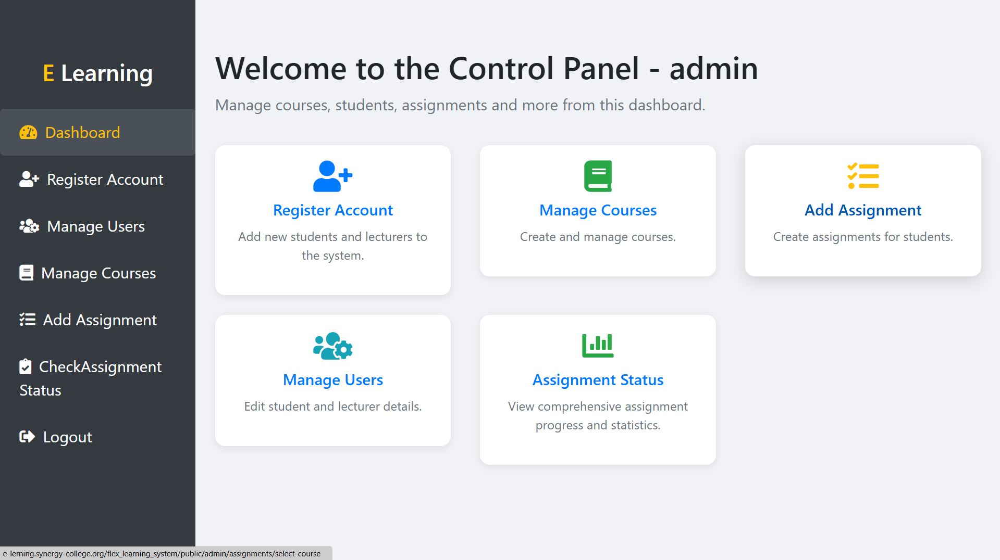
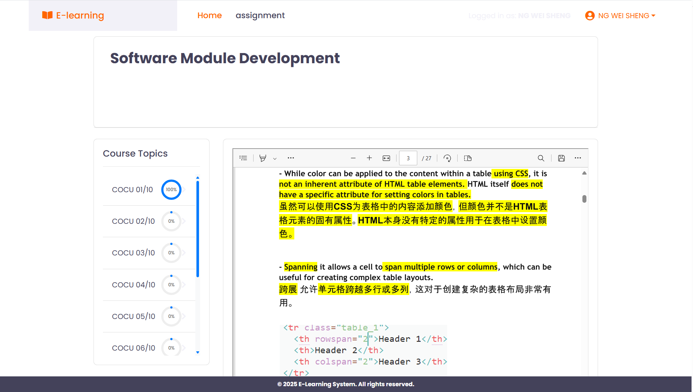
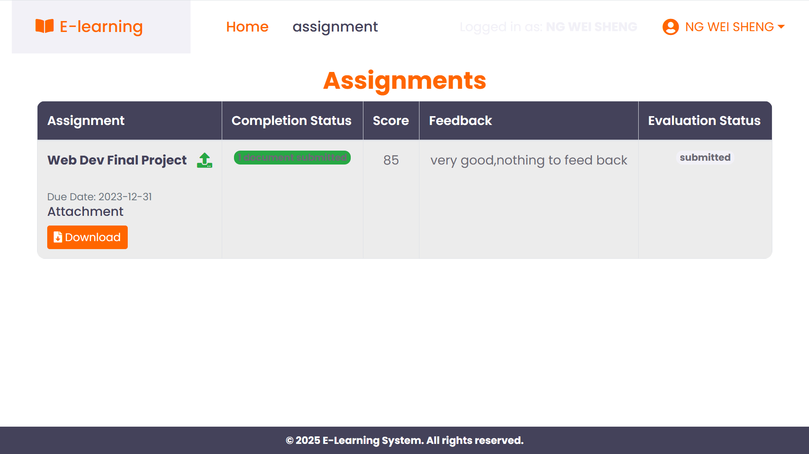

# Flex Learning System - E-Learning Portal

<p align="center">
  
</p>

<p align="center">
  <strong>Flex Learning System</strong> - A comprehensive e-learning platform built with Laravel
</p>

---

## Table of Contents / 目录

- [English Documentation](#english-documentation)
- [中文文档](#中文文档)
- [System Overview](#system-overview--系统概述)
- [Features](#features--功能特性)
- [Installation](#installation--安装指南)
- [Usage Guide](#usage-guide--使用指南)
- [Technical Documentation](#technical-documentation--技术文档)

---

## English Documentation

### System Overview

The **Flex Learning System** is a comprehensive e-learning portal designed to facilitate online education with multiple user roles, course management, assignment submission, and progress tracking. Built with Laravel framework, it provides a robust platform for educational institutions to manage their online learning programs.

### Key Features

- **Multi-Role User System**: Admin, Lecturer, and Student roles with different access levels
- **Course Management**: Create, edit, and manage courses with multimedia content
- **Assignment System**: Complete assignment creation, submission, and grading workflow
- **Progress Tracking**: Monitor student progress through topics and activities
- **File Management**: Upload and manage course materials, videos, documents, and slideshows
- **Responsive Design**: Mobile-friendly interface for all devices

### User Roles & Interfaces

#### 1. Admin Interface
- **Dashboard**: Overview of system statistics and quick access to management functions
- **User Management**: Register and manage students and lecturers
- **Course Management**: Create, edit, and organize courses
- **Assignment Management**: Create assignments and monitor submissions
- **System Monitoring**: Track assignment status and user activities

#### 2. Student Interface
- **Dashboard**: View enrolled courses and activities
- **Course Content**: Access course materials, videos, and documents
- **Assignment Submission**: Submit assignments with file uploads
- **Progress Tracking**: Monitor learning progress through topics
- **Profile Management**: Update personal information

#### 3. Lecturer Interface
- **Course Management**: Manage assigned courses and content
- **Student Monitoring**: Track student progress and submissions
- **Assignment Grading**: Grade and provide feedback on assignments

---

## 中文文档

### 系统概述

**Flex Learning System** 是一个全面的在线学习门户，旨在通过多用户角色、课程管理、作业提交和进度跟踪来促进在线教育。该系统基于 Laravel 框架构建，为教育机构提供了一个强大的在线学习项目管理平台。

### 主要功能

- **多角色用户系统**：管理员、讲师和学生角色，具有不同的访问级别
- **课程管理**：创建、编辑和管理包含多媒体内容的课程
- **作业系统**：完整的作业创建、提交和评分工作流程
- **进度跟踪**：监控学生通过主题和活动的学习进度
- **文件管理**：上传和管理课程材料、视频、文档和幻灯片
- **响应式设计**：适用于所有设备的移动友好界面

### 用户角色和界面

#### 1. 管理员界面
- **仪表板**：系统统计概览和快速访问管理功能
- **用户管理**：注册和管理学生和讲师
- **课程管理**：创建、编辑和组织课程
- **作业管理**：创建作业并监控提交情况
- **系统监控**：跟踪作业状态和用户活动

#### 2. 学生界面
- **仪表板**：查看注册的课程和活动
- **课程内容**：访问课程材料、视频和文档
- **作业提交**：通过文件上传提交作业
- **进度跟踪**：监控通过主题的学习进度
- **个人资料管理**：更新个人信息

#### 3. 讲师界面
- **课程管理**：管理分配的课程和内容
- **学生监控**：跟踪学生进度和提交情况
- **作业评分**：对作业进行评分和提供反馈

---

## Installation / 安装指南

### Prerequisites / 先决条件

- PHP 8.1 or higher
- Composer
- Node.js and NPM
- SQLite (or MySQL/PostgreSQL)
- Web server (Apache/Nginx)

### Step-by-Step Installation / 逐步安装

1. **Clone the repository / 克隆仓库**
   ```bash
   git clone <repository-url>
   cd flex_learning_system1
   ```

2. **Install PHP dependencies / 安装 PHP 依赖**
   ```bash
   composer install
   ```

3. **Install Node.js dependencies / 安装 Node.js 依赖**
   ```bash
   npm install
   ```

4. **Environment setup / 环境设置**
   ```bash
   cp .env.example .env
   php artisan key:generate
   ```

5. **Database setup / 数据库设置**
   ```bash
   php artisan migrate
   php artisan db:seed
   ```

6. **Storage setup / 存储设置**
   ```bash
   php artisan storage:link
   ```

7. **Start the development server / 启动开发服务器**
   ```bash
   php artisan serve
   ```

8. **Access the application / 访问应用程序**
   - Open your browser and go to `http://localhost:8000`

### Default Login Credentials / 默认登录凭据

- **Admin**: admin@gmail.com / 123
- **Student**: jane@gmail.com / jane123
- **Student**: peter@gmail.com / peter123

---

## Quick Start Guide / 快速开始指南

### Getting Started / 开始使用

#### Step 1: Access the System / 步骤1：访问系统
1. Open your web browser
2. Navigate to your application URL (e.g., `https://e-lerning.synergy-college.org/flex_learning_system/public/`)
3. You'll see the main login page as shown below:


*Main login interface - Enter your credentials to access the system / 主登录界面 - 输入凭据访问系统*

#### Step 2: Login as Admin / 步骤2：以管理员身份登录
1. Enter admin credentials: `admin@gmail.com` / `123`
2. Click "Login" button
3. You'll be redirected to the admin dashboard


*User registration interface for creating new accounts / 用户注册界面，用于创建新账户*

#### Step 3: Explore Admin Features / 步骤3：探索管理员功能
The admin dashboard provides access to all system management functions:


*Admin dashboard with navigation sidebar and quick access cards / 管理员仪表板，包含导航侧边栏和快速访问卡片*

**Available Functions / 可用功能:**
- **Register Account**: Add new students and lecturers
- **Manage Users**: Edit existing user accounts
- **Manage Courses**: Create and organize courses
- **Add Assignment**: Create assignments for students
- **Check Assignment Status**: Monitor submissions

#### Step 4: Create Your First Course / 步骤4：创建第一个课程
1. Click "Manage Courses" from the sidebar
2. Click "Add New Course" button
3. Fill in course details:
   - Course title
   - Description
   - Cover image
   - Start and end dates
4. Save the course


*Course management interface for creating and organizing courses / 课程管理界面，用于创建和组织课程*

#### Step 5: Add Course Content / 步骤5：添加课程内容
1. Select your created course
2. Add CU Activities (Course Units)
3. Create topics within activities
4. Upload materials:
   - Videos
   - Documents (PDFs)
   - Slideshows (PowerPoint)
   - Images


*CU Activities management interface for organizing course content / CU活动管理界面，用于组织课程内容*

#### Step 6: Register Students / 步骤6：注册学生
1. Click "Register Account" from sidebar
2. Fill student information:
   - Name
   - Email
   - Password
   - Role: Student
3. Assign to appropriate course
4. Save registration

#### Step 7: Create Assignments / 步骤7：创建作业
1. Click "Add Assignment" from sidebar
2. Select target course
3. Choose activity for assignment
4. Set assignment details:
   - Assignment name
   - Description
   - Due date
   - Upload assignment files
5. Save assignment

#### Step 8: Student Experience / 步骤8：学生体验
Students can now:
1. Login with their credentials
2. View enrolled courses on dashboard
3. Access course materials and videos
4. Submit assignments
5. Track their progress


*Student view of course topics and materials / 学生查看课程主题和材料*


*Student assignment submission interface / 学生作业提交界面*


*Admin view of assignment management / 管理员作业管理界面*

---

## Usage Guide / 使用指南

### Step-by-Step Visual Guide / 逐步视觉指南

#### 1. Login Page / 登录页面


*Main login interface where users can access the system / 主登录界面，用户可以在此访问系统*

**Steps / 步骤:**
1. Open your browser and navigate to the application URL
2. Enter your email and password
3. Click "Login" to access your dashboard

**Default Credentials / 默认凭据:**
- Admin: `admin@gmail.com` / `123`
- Student: `jane@gmail.com` / `jane123`

---

### For Administrators / 管理员使用指南

#### 1. Admin Dashboard / 管理员仪表板


*Admin dashboard with quick access cards and navigation sidebar / 管理员仪表板，包含快速访问卡片和导航侧边栏*

**Features Available / 可用功能:**
- **Dashboard**: System overview and statistics
- **Register Account**: Add new students and lecturers
- **Manage Users**: Edit or delete existing users
- **Manage Courses**: Create and organize courses
- **Add Assignment**: Create assignments for students
- **Check Assignment Status**: Monitor submissions

#### 2. User Registration / 用户注册


*User registration interface for creating new accounts / 用户注册界面，用于创建新账户*

**Step-by-Step Process / 逐步过程:**

1. **Click "Register Account"** / 点击"注册账户"
   - Navigate to the registration page from the sidebar

2. **Fill User Information** / 填写用户信息
   - Enter name, email, password
   - Select role (Student/Lecturer)
   - Choose course assignment if applicable

3. **Submit Registration** / 提交注册
   - Click "Register" to create the account
   - User will receive confirmation

#### 3. Course Management / 课程管理


*Course management interface for creating and organizing courses / 课程管理界面，用于创建和组织课程*

**Creating a New Course / 创建新课程:**

1. **Access Course Management** / 访问课程管理
   - Click "Manage Courses" from sidebar
   - View existing courses list

2. **Add New Course** / 添加新课程
   - Click "Add New Course" button
   - Fill course details:
     - Course title
     - Description
     - Cover image
     - Start/End dates

3. **Course Activities** / 课程活动
   - Add CU Activities (Course Units)
   - Organize content into topics
   - Upload materials (videos, documents, slideshows)


*CU Activities management interface for organizing course content / CU活动管理界面，用于组织课程内容*

#### 4. Assignment Management / 作业管理


*Assignment creation and management interface / 作业创建和管理界面*

**Creating Assignments / 创建作业:**

1. **Select Course** / 选择课程
   - Click "Add Assignment" from sidebar
   - Choose the target course

2. **Assignment Details** / 作业详情
   - Enter assignment name
   - Add description
   - Set due date
   - Upload assignment files

3. **Monitor Submissions** / 监控提交
   - View assignment status
   - Check student submissions
   - Grade and provide feedback

### For Students / 学生使用指南

#### 1. Student Dashboard / 学生仪表板


*Student dashboard showing enrolled courses and activities / 学生仪表板显示注册的课程和活动*

**Step-by-Step Access / 逐步访问:**

1. **Login as Student** / 以学生身份登录
   - Use student credentials (e.g., jane@gmail.com / jane123)
   - System redirects to student dashboard

2. **View Enrolled Courses** / 查看注册课程
   - Dashboard shows all enrolled courses
   - Each course displays activities and progress

3. **Navigate Course Content** / 导航课程内容
   - Click on course activities to access content
   - View topics, videos, and materials

#### 2. Course Content Access / 课程内容访问

**Accessing Course Materials / 访问课程材料:**

1. **Select Course Activity** / 选择课程活动
   - Click on any course activity from dashboard
   - View available topics and materials

2. **View Course Topics** / 查看课程主题
   - Browse through different topics
   - Access videos, documents, and slideshows
   - Track your progress for each topic

3. **Download Materials** / 下载材料
   - Click download links for documents
   - Access slideshow presentations
   - Stream or download video content

#### 3. Assignment Submission Process / 作业提交过程


*Assignment submission interface for students / 学生作业提交界面*

**Step-by-Step Submission / 逐步提交:**

1. **View Available Assignments** / 查看可用作业
   - Navigate to "Assignments" section
   - View all assigned tasks with due dates
   - Check assignment requirements and files

2. **Submit Assignment** / 提交作业
   - Click on specific assignment
   - Upload your work files
   - Add comments or notes
   - Submit before due date

3. **Check Submission Status** / 检查提交状态
   - View submission confirmation
   - Check for grades and feedback
   - Resubmit if allowed by instructor

#### 4. Progress Tracking / 进度跟踪

**Monitoring Learning Progress / 监控学习进度:**

1. **Topic Completion** / 主题完成
   - Mark topics as completed
   - View progress indicators
   - Track overall course progress

2. **Assignment Status** / 作业状态
   - View submitted assignments
   - Check grades and feedback
   - Monitor pending tasks

### For Lecturers / 讲师使用指南

#### 1. Lecturer Access / 讲师访问
- Login with lecturer credentials
- Access admin interface with lecturer permissions
- Manage assigned courses and content

#### 2. Course Content Management / 课程内容管理
- **Edit Course Materials**: Update videos, documents, and slideshows
- **Manage Topics**: Add or modify learning topics
- **Organize Activities**: Structure course units effectively

#### 3. Student Monitoring / 学生监控
- **View Student Progress**: Track completion rates and engagement
- **Monitor Enrollments**: See which students are enrolled in courses
- **Check Activity**: Review student participation and progress

#### 4. Assignment Grading / 作业评分
- **Review Submissions**: Access student assignment submissions
- **Provide Grades**: Assign scores and feedback
- **Track Completion**: Monitor assignment completion rates

---

## Interface Features Explained / 界面功能详解

### Main Navigation Elements / 主要导航元素

#### 1. Sidebar Navigation / 侧边栏导航
- **Dashboard**: Quick access to main functions
- **User Management**: Register and manage users
- **Course Management**: Create and organize courses
- **Assignment Tools**: Create and monitor assignments
- **System Monitoring**: Track system status and activities

#### 2. Dashboard Cards / 仪表板卡片
- **Quick Access**: Direct links to common functions
- **Statistics**: System overview and metrics
- **Recent Activity**: Latest updates and notifications

#### 3. Content Management / 内容管理
- **File Upload**: Support for videos, documents, slideshows
- **Progress Tracking**: Visual indicators for completion
- **Assignment Status**: Real-time submission monitoring

### Key System Features / 关键系统功能

#### 1. Multi-Media Support / 多媒体支持
- **Video Streaming**: Direct video playback in browser
- **Document Downloads**: PDF and other document formats
- **Slideshow Presentations**: PowerPoint and similar formats
- **Image Galleries**: Course-related images and graphics

#### 2. Assignment Workflow / 作业工作流程
- **Creation**: Admin creates assignments with due dates
- **Distribution**: Automatic assignment to enrolled students
- **Submission**: Students upload files with comments
- **Grading**: Instructors provide grades and feedback
- **Tracking**: Real-time status monitoring

#### 3. Progress Monitoring / 进度监控
- **Topic Completion**: Track individual topic progress
- **Course Progress**: Overall course completion rates
- **Assignment Status**: Submission and grading status
- **User Activity**: Login and engagement tracking

### Security and Access Control / 安全和访问控制

#### 1. Role-Based Access / 基于角色的访问
- **Admin**: Full system access and management
- **Lecturer**: Course and student management
- **Student**: Course access and assignment submission

#### 2. File Security / 文件安全
- **Upload Validation**: File type and size restrictions
- **Access Control**: Role-based file access
- **Storage Security**: Secure file storage and retrieval

#### 3. Data Protection / 数据保护
- **CSRF Protection**: Form security measures
- **Input Validation**: Data sanitization and validation
- **Session Management**: Secure user sessions

---

## Technical Documentation / 技术文档

### System Architecture / 系统架构

The Flex Learning System is built using the following technologies:

- **Backend**: Laravel 10.x (PHP Framework)
- **Frontend**: Blade Templates with Bootstrap 5
- **Database**: SQLite (configurable to MySQL/PostgreSQL)
- **File Storage**: Laravel Storage with local filesystem
- **Authentication**: Laravel Sanctum

### Database Structure / 数据库结构

#### Core Tables / 核心表

1. **users** - User accounts with role-based access
2. **courses** - Course information and metadata
3. **enrollments** - User-course relationships with roles
4. **cu_activities** - Course unit activities
5. **topics** - Individual learning topics within activities
6. **assignments** - Assignment definitions and requirements
7. **assignment_submits** - Student assignment submissions
8. **topic_progress** - Student progress tracking

#### Key Relationships / 关键关系

- Users can have multiple enrollments in different courses
- Courses contain multiple CU Activities
- Activities contain multiple Topics
- Assignments are linked to specific activities
- Students submit assignments which are graded by instructors

### File Structure / 文件结构

```
flex_learning_system1/
├── app/
│   ├── Http/Controllers/     # Application controllers
│   ├── Models/              # Eloquent models
│   └── Middleware/          # Custom middleware
├── database/
│   ├── migrations/          # Database schema definitions
│   ├── seeders/            # Database seeders
│   └── factories/          # Model factories
├── resources/
│   └── views/              # Blade templates
├── routes/
│   └── web.php             # Web routes
└── public/
    ├── css/                # Stylesheets
    ├── js/                 # JavaScript files
    └── storage/            # File uploads
```

### API Endpoints / API 端点

The system uses traditional web routes with form submissions. Key routes include:

- **Authentication**: `/login`, `/register`, `/logout`
- **Admin Routes**: `/admin/*` (protected by admin middleware)
- **Student Routes**: `/student/*` (protected by student middleware)
- **File Operations**: Download and upload endpoints for course materials

### Security Features / 安全功能

- **Role-based Access Control**: Different access levels for admin, lecturer, and student
- **CSRF Protection**: All forms protected against CSRF attacks
- **File Upload Security**: Validated file types and sizes
- **Authentication Middleware**: Protected routes require proper authentication
- **Input Validation**: All user inputs are validated and sanitized

### Configuration / 配置

Key configuration files:

- **`.env`**: Environment variables and database configuration
- **`config/database.php`**: Database connection settings
- **`config/filesystems.php`**: File storage configuration
- **`config/auth.php`**: Authentication settings

### Troubleshooting / 故障排除

#### Common Issues / 常见问题

1. **File Upload Issues**: Check storage permissions and file size limits
2. **Database Connection**: Verify database configuration in `.env`
3. **Authentication Problems**: Clear cache and regenerate application key
4. **Storage Links**: Run `php artisan storage:link` if files are not accessible

#### Performance Optimization / 性能优化

- Enable query caching for frequently accessed data
- Optimize file storage for large multimedia content
- Use database indexing for better query performance
- Implement pagination for large data sets

---

## Contributing / 贡献

We welcome contributions to improve the Flex Learning System. Please follow these guidelines:

1. Fork the repository
2. Create a feature branch
3. Make your changes
4. Test thoroughly
5. Submit a pull request

## License / 许可证

This project is open-sourced software licensed under the [MIT license](https://opensource.org/licenses/MIT).

---

## Support / 支持

For support and questions:
- Create an issue in the repository
- Contact the development team
- Check the documentation for common solutions

---

*Last updated: January 2025*
*最后更新：2025年1月*
